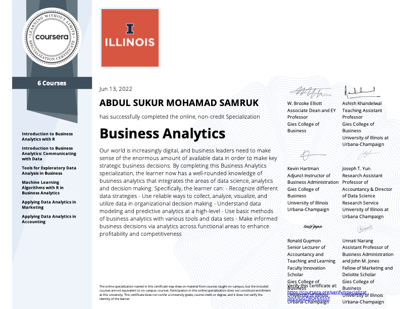

## Business Analytics Specialization
**University of Illinois at Urbana-Champaign** | Coursera | Part of the iMBA Program

---

This repository contains assignments and projects completed as part of the **Business Analytics Specialization** — a rigorous, graduate-level program taught by University of Illinois at Urbana-Champaign faculty. The specialization builds end-to-end analytical skills, from data wrangling and exploratory analysis to predictive modeling and communicating insights.

Previously completed the **Google Data Analytics Professional Certificate**, which motivated me to pursue this deeper, application-focused program.

---

### Skills Demonstrated

| Area | Tools / Techniques |
|---|---|
| Data Wrangling | R (date-time objects, data frames, package management) |
| Exploratory Data Analysis | Histograms, bar charts, distribution analysis |
| Machine Learning | Regression modeling, model evaluation, statistical inference |
| Data Communication | Peer-reviewed data storytelling, word cloud visualization |
| Cross-platform Analytics | Comparison of R, Python, and SAS workflows |

---

### Course Breakdown

**1. Introduction to Business Analytics with R**
- Manipulated date-time objects and formatted temporal data for business reporting
- Applied core R programming for data ingestion, transformation, and output

**2. Tools for Exploratory Data Analysis in Business**
- Produced visualizations (histograms, bar charts, distribution plots) to uncover patterns in business data
- Evaluated and compared analytical workflows across R, Python, and SAS

**3. Machine Learning Algorithms: Regression**
- Built and interpreted regression models for business forecasting
- Assessed model fit, residuals, and statistical significance of predictors

**4. Data Communication (Peer-Reviewed Assignment)**
- Designed a data-driven narrative and presented findings to a non-technical audience

**5. Word Cloud Peer Assignment**
- Applied text analytics techniques to visualize frequency patterns in unstructured data

---

### Certificate

---

