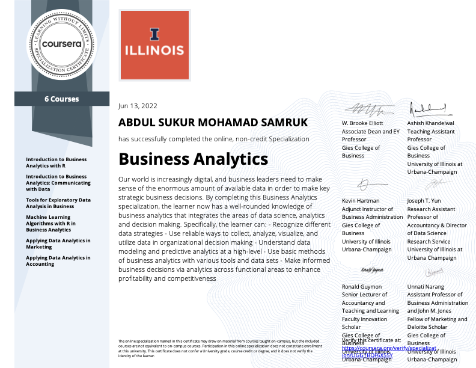

# Business Analytics Specialization

**Institution:** University of Illinois at Urbana-Champaign (part of the iMBA Program)
**Platform:** Coursera &nbsp;|&nbsp; **Level:** Graduate

---

## Overview

This repository documents work completed in the **Business Analytics Specialization** — a graduate-level, application-focused program taught by UIUC faculty. The program covers the full analytical workflow: data ingestion and wrangling, exploratory analysis and visualization, predictive modeling, and communicating insights to non-technical stakeholders.

I previously completed the **Google Data Analytics Professional Certificate**, which gave me a solid foundation. This specialization deepened my skills with rigorous, business-oriented application of machine learning and statistical modeling.

---

## What I Bring to a Business Analytics Role

| Competency | What I Can Do |
|---|---|
| **Data Wrangling** | Clean, reshape, and prepare messy real-world data for analysis using R |
| **Exploratory Analysis** | Identify trends, distributions, and anomalies through purposeful visualization |
| **Predictive Modeling** | Build, evaluate, and interpret regression models for business forecasting |
| **Statistical Inference** | Assess model fit, residuals, significance, and communicate uncertainty |
| **Data Storytelling** | Translate analytical findings into clear narratives for non-technical audiences |
| **Text Analytics** | Apply NLP techniques (word frequency, cloud visualization) to unstructured data |

---

## Specialization Certificate

